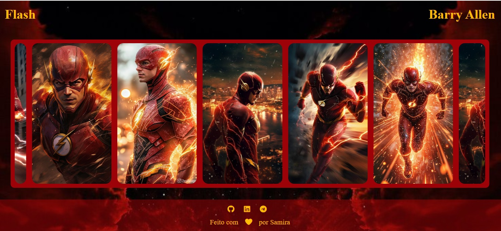

# ⚡ Carrossel Flash  

  

> 🔗 **Demo Online:** [Carrossel Flash no GitHub Pages](https://samirasfonseca.github.io/carrossel-flash/)  

---

## ✨ Preview  

  

  

---

## 🚀 Funcionalidades  
- 🎞️ **Autoplay horizontal infinito** (as imagens deslizam sozinhas)  
- 🖱️ **Hover com destaque** (a imagem cresce ao passar o mouse)  
- 📱 **Responsivo** (funciona em desktop e mobile)  
- 👆 **Clique em mobile** para destacar uma imagem  
- ♾️ **Loop infinito** sem cortes (imagens duplicadas dinamicamente)  

---

## 🛠️ Tecnologias  
- ⚡ **HTML5**  
- 🎨 **CSS3 (Flexbox + animações)**  
- 🧩 **JavaScript (DOM + setInterval)**  

---

## 📂 Estrutura do projeto  

Carrossel-Flash/ 
│ 
├── assets/ 
│   ├── css/ 
│   │   ├── main.css 
│   │   ├── navbar.css 
│   │   └── footer.css 
│   ├── js/ 
│   │   └── main.js 
│   └── img/ 
│       ├── flash1.jpg 
│       ├── flash2.jpg 
│       └── ... 
│
├── index.html 
└── README.md 

## 👩‍💻 Autora

Feito com ❤️ por Samira Fonseca

    

⚡ Extra

  

⭐ Se você gostou desse projeto, não esqueça de deixar uma estrelinha no repositório!

⚡“A velocidade não é nada sem controle. E no código, cada detalhe importa.”